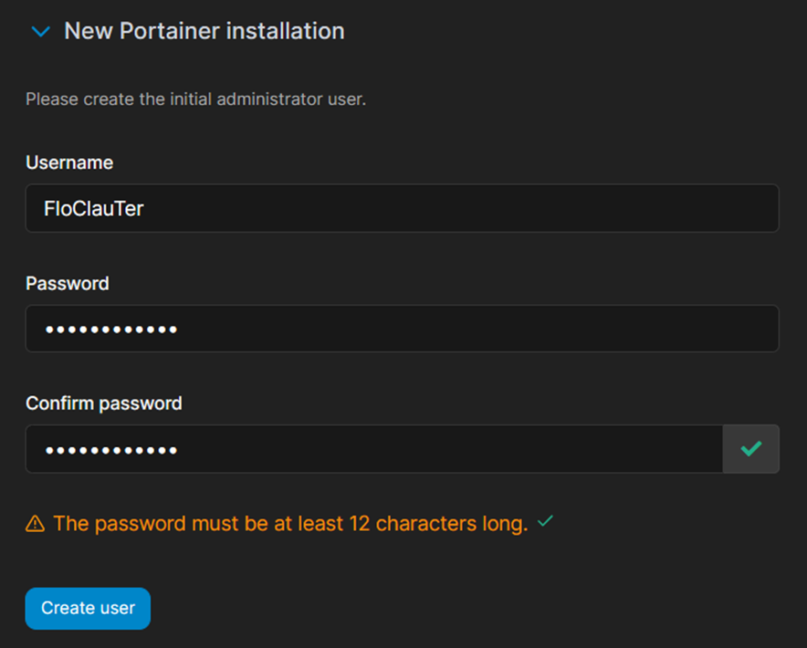
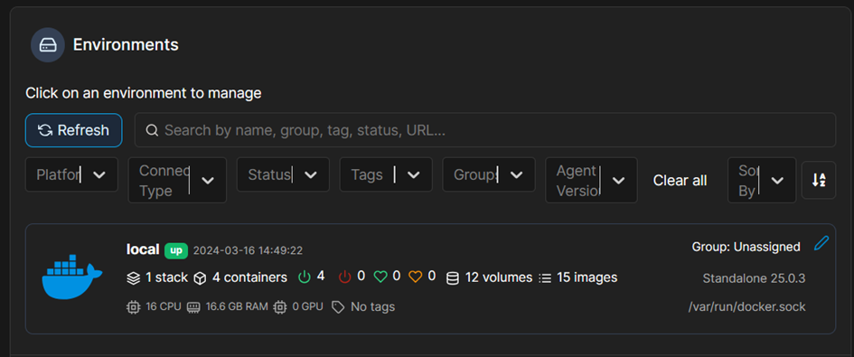
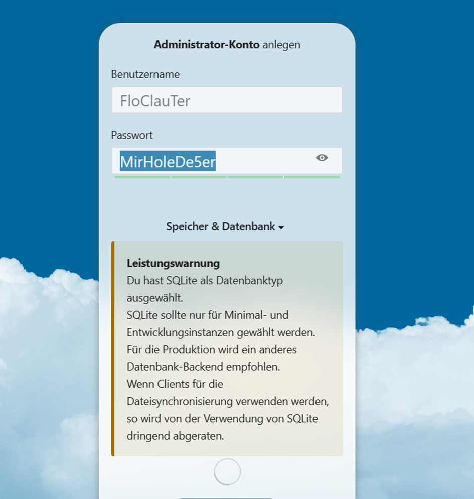
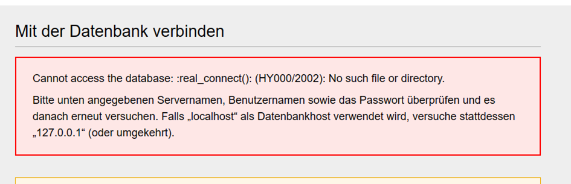
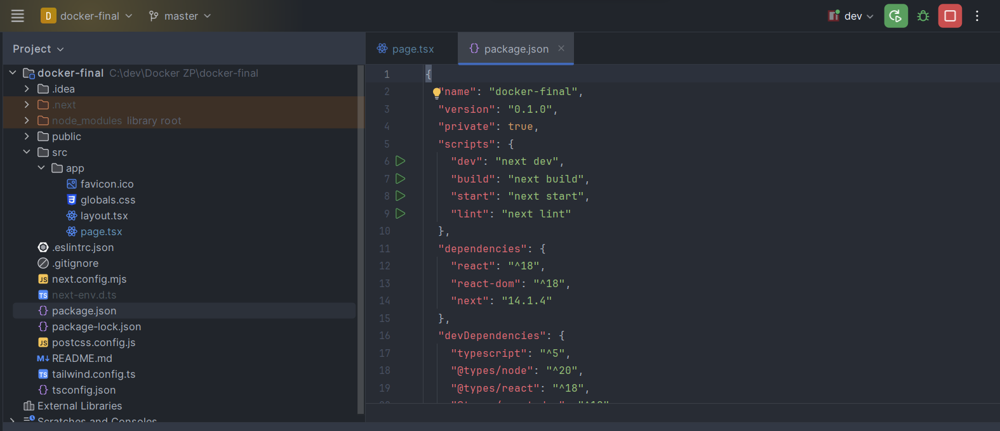
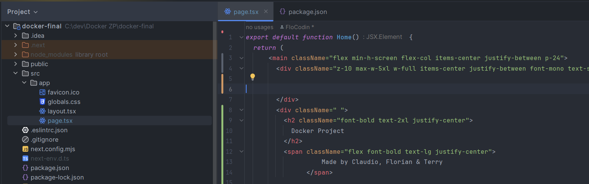

# Docker-Compose-Konfigurationsdokumentation mit MySQL-Integration für GitLab
Diese Dokumentation beschreibt die Docker-Compose-Konfigurationsdatei, 
die MediaWiki, Nextcloud, GitLab, MySQL und Portainer-Container definiert und konfiguriert. 
Die Konfiguration umfasst die Integration einer MySQL-Datenbank für GitLab.

### Dienste und Konfigurationen:
mediawiki-Service:
Image: mediawiki
Ports: Der Service wird auf Port 8085 des Hosts ausgeführt und ist mit Port 80 des Containers verbunden.
Volumes: Ein Docker-Volume mediawiki_data wird verwendet, um die Daten des MediaWiki-Containers persistent zu speichern.
Restart: Der Service wird immer automatisch neu gestartet, falls ein Fehler auftritt.

### nextcloud-Service:
Image: nextcloud
Ports: Der Service wird auf Port 8080 des Hosts ausgeführt und ist mit Port 80 des Containers verbunden.
Volumes: Ein Docker-Volume nextcloud_data wird verwendet, um die Daten des Nextcloud-Containers persistent zu speichern.
Restart: Der Service wird immer automatisch neu gestartet, falls ein Fehler auftritt.

### gitlab-Service:
Image: gitlab/gitlab-ce
Ports: Der Service wird auf Port 4444 des Hosts ausgeführt und ist mit Port 80 des Containers verbunden.
Volumes: Ein Docker-Volume gitlab_data wird verwendet, um die Daten des GitLab-Containers persistent zu speichern.
Umgebungsvariablen:
GITLAB_OMNIBUS_CONFIG: Konfiguration von GitLab, um die MySQL-Datenbank zu verwenden.
Restart: Der Service wird immer automatisch neu gestartet, falls ein Fehler auftritt.

### mysql-Service:
Image: mysql:latest
Umgebungsvariablen: Konfiguration des MySQL-Dienstes mit einem Root-Passwort.
Volumes: Ein Docker-Volume mysql_data wird verwendet, um die Daten der MySQL-Datenbank persistent zu speichern.
Restart: Der Service wird immer automatisch neu gestartet, falls ein Fehler auftritt.

### portainer-Service:
Image: portainer/portainer
Ports: Der Service wird auf Port 9000 des Hosts ausgeführt und ist mit Port 9000 des Containers verbunden.
Volumes: Das Docker-Socket-Volume /var/run/docker.sock wird verwendet, um auf die Docker-Engine des Hosts zuzugreifen.
Restart: Der Service wird immer automatisch neu gestartet, falls ein Fehler auftritt.

### Konfigurationsspezifika:
Für GitLab wurde eine MySQL-Datenbank integriert, um die Daten zu speichern. Die Umgebungsvariable GITLAB_OMNIBUS_CONFIG wird verwendet, um GitLab zu konfigurieren, damit es die MySQL-Datenbank verwendet.

### Volumes:
Es wurden separate Docker-Volumes für jede Anwendung erstellt, um die Daten persistent zu speichern:
mediawiki_data, nextcloud_data, gitlab_data und mysql_data.
Diese Docker-Compose-Konfigurationsdatei ermöglicht das gleichzeitige Bereitstellen mehrerer Dienste, 
darunter MediaWiki, Nextcloud, GitLab mit MySQL-Integration, MySQL-Datenbank und Portainer für die Docker-Container-Verwaltung. 
Die Integration der MySQL-Datenbank ermöglicht eine effiziente Datenpersistenz und -verwaltung für den GitLab-Dienst.

### Installation der Services

#### Portainer
Bei Portainer haben wir uns angemeldet, und Anschliessend einen Überblick verschafft. 
Wir haben die Docker Version ohne Zusätzliche Enviroments gewählt. 
Die Container wurden Problemlos erkannt und waren steuerbar über unseren Localhost.

#### Nextcloud
Hier haben wir wie Überall im Lokalen nutzen die selben Daten gewählt.
Die von Nextcloud vorgeschlagenen Zusatzinstallationen haben wir übersprungen.
Anschliessend haben Wir etwas getestet und gespielt 
Und abschliessend haben wir noch eine Datei in einen von Uns erstellten Ordner Hochgeladen (das Logo meiner Firma) 

#### Media Wiki

Hier kamen wir zu dem Problem dass wir eine Datenbank benötigten um es zu Installieren mit folgendenen Fehlermeldungen: 
Wie wir alles benannt haben: 

## Website

Angefangen habe ich damit rumzuexperimentieren ob ein Simples HTML reicht, da mir dies nicht gefiel hab ich mich schnell für eine Next-app entschieden.
Next.js is ein auf React basierendes JavaScript Framework. Anschlissend habe ich die Template Seite nur kurz angepasst und das ganze in einem seperaten Projekt fertig gemacht. 
Da ich im aktuellen Projekt kein Node Interpret integriert hatte gab es beim versuch der Intergrierung nur Probleme. Hier die Erklärung:

Im Package.json File ist der Prozess "run dev" der den Localhost:3000 startet. 
Dieser Command kann auch über das Terminal eingegben werden. 

Hier sehen wir auf der Linken Seite die Ordnerstruktur wo wir im App Directory auch die Page.tsx haben. Diese gibt den Inhalt zurück den wir auf Localhost:3000 sehen. 

Webseite: 

### Prozesse

Wichtig ist dass alle Container gestartet werden und der Comman run dev ( npm/yarn) verwendet wird. 
